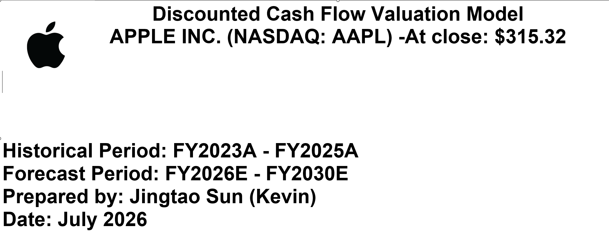
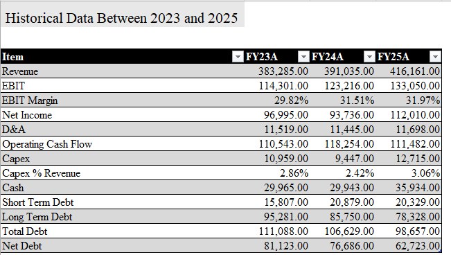
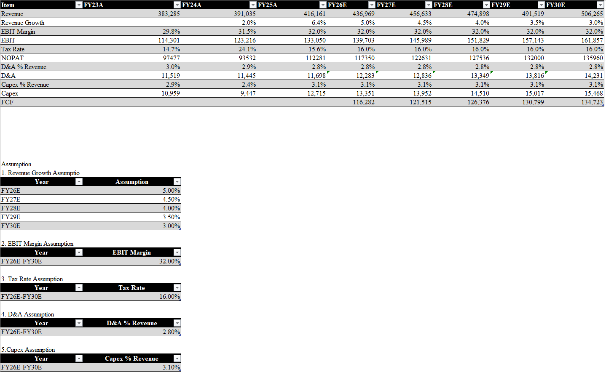
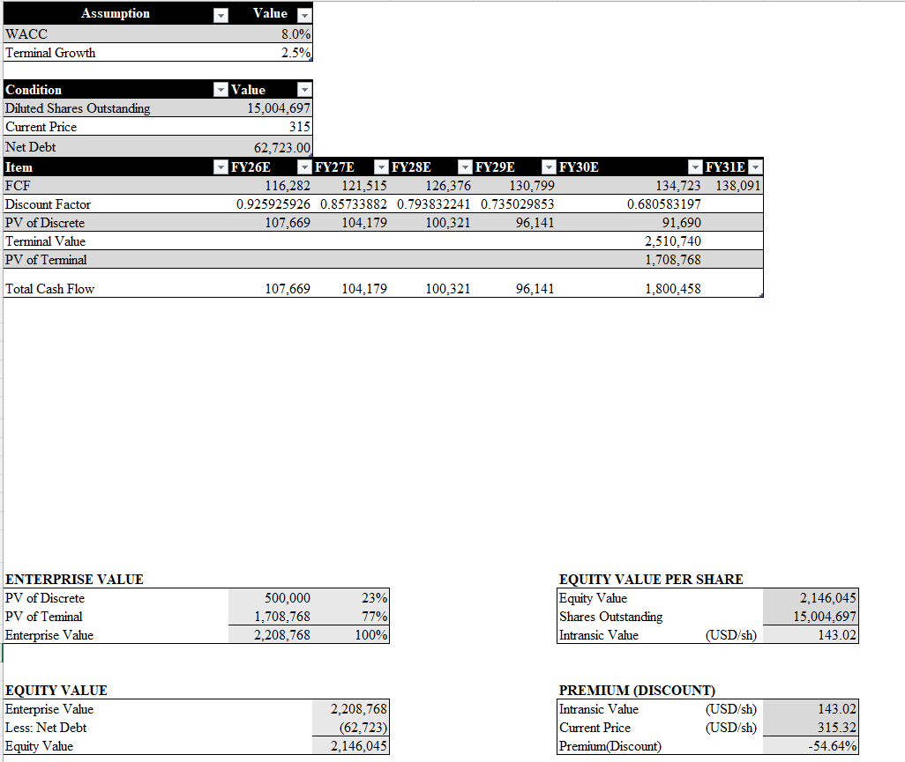
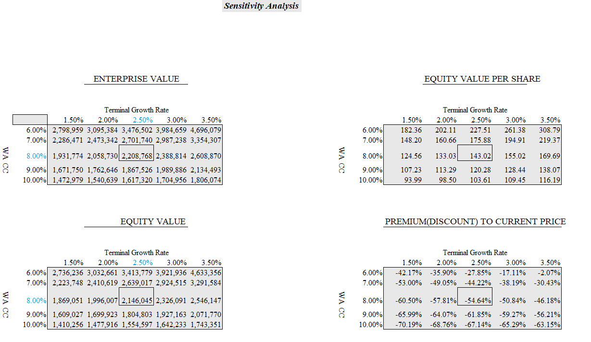

# Apple Inc. (NASDAQ: AAPL) — Discounted Cash Flow (DCF) Valuation Model

A full Discounted Cash Flow (DCF) valuation model for Apple Inc. built entirely in Excel using publicly available SEC 10-K filings.

This project was created to demonstrate practical financial modelling, valuation methodology, forecasting assumptions, terminal value analysis, and sensitivity analysis commonly used in Investment Banking, Equity Research, Corporate Finance, and Private Equity.

---

## Project Overview

This model estimates Apple's intrinsic value using a Free Cash Flow to Firm (FCFF) approach.

The valuation process follows the standard DCF workflow:

Revenue Forecast
→ EBIT Projection
→ NOPAT Calculation
→ FCFF Forecast
→ Discounted Cash Flow Analysis
→ Enterprise Value
→ Equity Value
→ Intrinsic Value Per Share

---

## Model Structure

### 1. Cover Page

### 2. Historical Financial Data (FY2023A – FY2025A)

Data source:

- Apple FY2025 Form 10-K
- Apple FY2024 Form 10-K
- Apple FY2023 Form 10-K

---

### 3. Forecast Period (FY2026E – FY2030E)

---

## DCF Methodology

---

## Sensitivity Analysis

---

### Revenue Forecast

Revenue was projected using a declining growth assumption to reflect Apple's transition toward a mature growth profile.

---

### EBIT Projection

EBIT was estimated using a constant operating margin assumption.

Formula:

EBIT = Revenue × EBIT Margin

---

### NOPAT

NOPAT = EBIT × (1 − Tax Rate)

---

### FCFF

FCFF = NOPAT + D&A − Capex

For simplicity, changes in Net Working Capital were assumed to be negligible:

ΔNWC = 0

---

### Terminal Value

The Gordon Growth Method was used:

TV = FCFₙ × (1 + g) / (WACC − g)

---

### Enterprise Value

EV = PV(Explicit Forecast Period Cash Flows) + PV(Terminal Value)

---

### Equity Value

Equity Value = Enterprise Value − Net Debt

---

### Intrinsic Value Per Share

Intrinsic Value Per Share = Equity Value / Diluted Shares Outstanding

---

## Valuation Results

| Metric | Value |
|--------|------|
| Enterprise Value | $2.21 Trillion |
| Equity Value | $2.15 Trillion |
| Intrinsic Value Per Share | $143.02 |
| Current Market Price on JULY 10, 2026 | $315.32 |
| Implied Upside / (Downside) | -54.64% |

---

## Sensitivity Analysis

A two-dimensional sensitivity analysis was performed using:

- WACC range: 6.0% – 10.0%
- Terminal Growth range: 1.5% – 3.5%

The model demonstrates the significant impact that discount rates and terminal growth assumptions have on valuation outputs.

Base Case:

- WACC = 8.0%
- Terminal Growth = 2.5%
- Intrinsic Value = $143.02/share

---

## Key Takeaways

- Terminal Value contributed approximately 77% of total Enterprise Value.
- Explicit forecast cash flows contributed approximately 23%.
- The model highlights the sensitivity of DCF valuation to discount rate assumptions.
- Apple's market valuation appears to imply growth expectations beyond the model's conservative assumptions.

---

